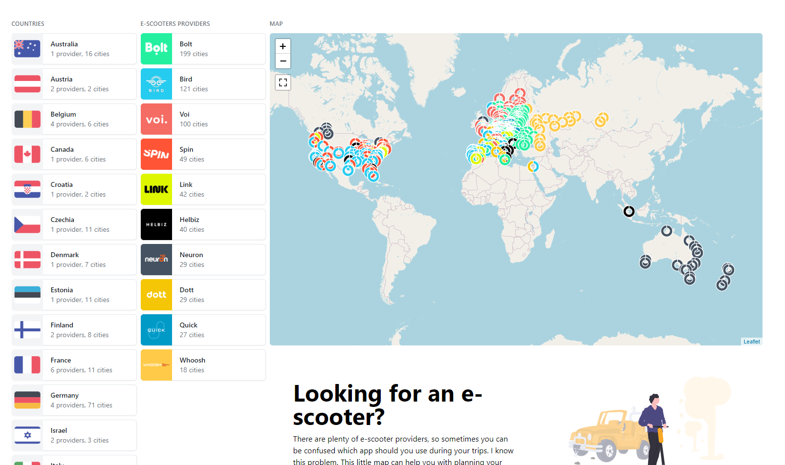

## Escooters

### Ideas for implementation

- Limited map zoom out
- Searching cities by text
- Links to providers apps

### Last build
```
Build date: 2023-03-24 19:24:11

199 cities fetched for Bolt.
27 cities fetched for Quick.
100 cities fetched for Voi.
42 cities fetched for Link.
49 cities fetched for Spin.
29 cities fetched for Neuron.
40 cities fetched for Helbiz.
18 cities fetched for Whoosh.
121 cities fetched for Bird.
29 cities fetched for Dott.

503 cities fetched.
Cached cities loaded.

```

### Available providers

| No. | Provider | Data source |
|---|---|---|
| 1 | Bolt | web API |
| 2 | Bird | webscrapped with partially estimated countries |
| 3 | Voi | webscrapped |
| 4 | Spin | webscrapped |
| 5 | Link | webscrapped |
| 6 | Dott | webscrapped |
| 7 | Quick | webscrapped |
| 8 | Neuron | partially webscrapped |
| 9 | Whoosh | hardcoded |
| 10 | Helbiz | hardcoded |

### Screenshot



### Development

```
copy .env.example .env
docker-compose run --rm -u "$(id -u):$(id -g)" php composer install
docker-compose run --rm -u "$(id -u):$(id -g)" php php index.php
```
